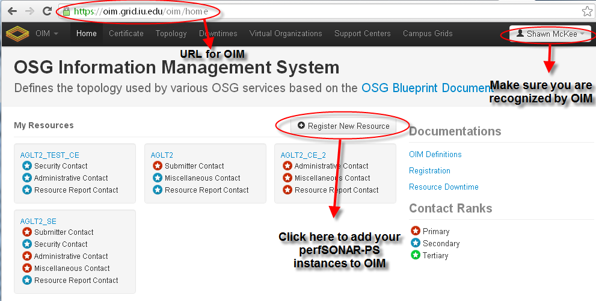
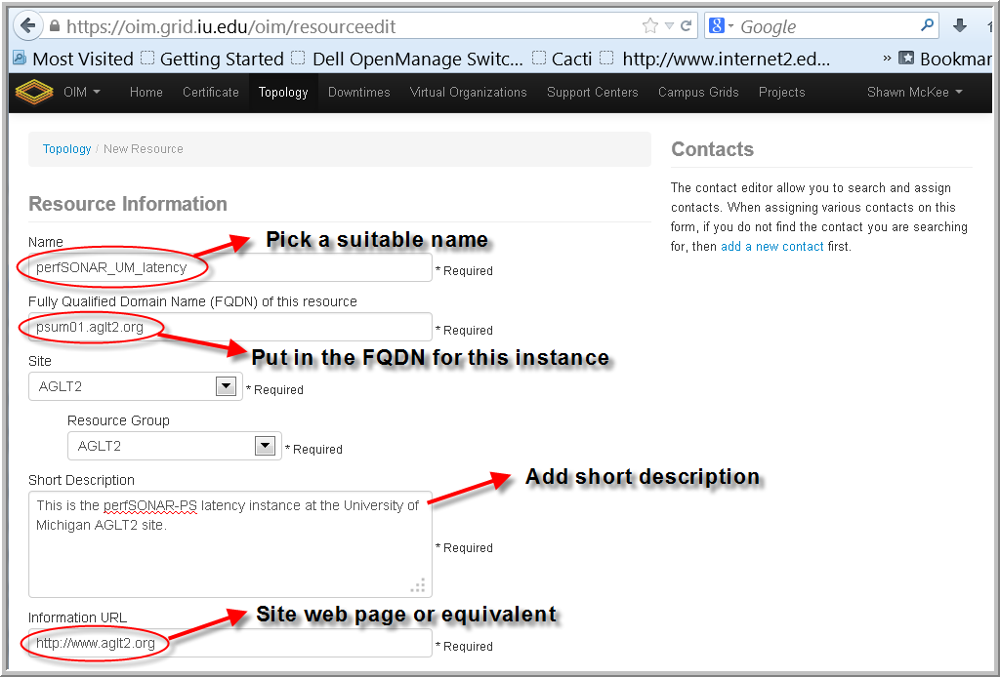
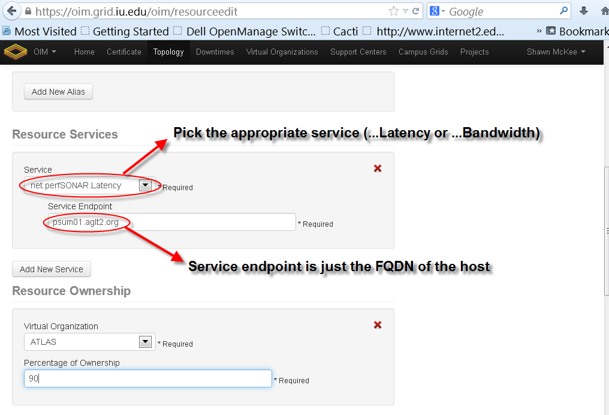
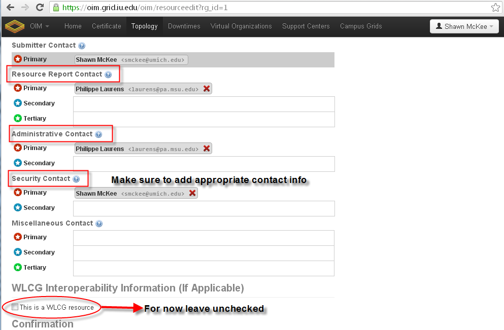
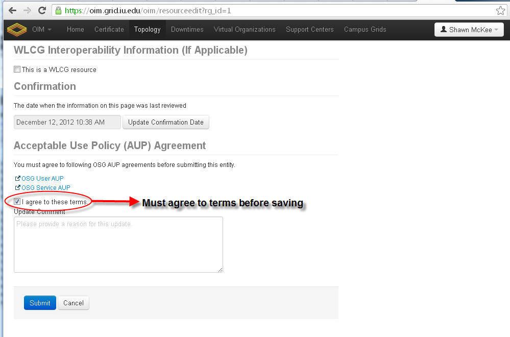

Register perfSONAR in OIM
====================================================================

!!! warning
	These instructions were revised on October 1, 2013.** If you registered your perfSONAR instances in OIM following instructions prior to this date please update them using the following instructions. The summary of the change: Instead of registering one resource per "Site" and then having two services (latency and bandwidth) for that resource, the new instructions are to register each site/service combination as one resource. For example a Tier-2 with two sites (A,B) will now need to register 4 resources: **latency\_A**, **latency\_B**, **bandwidth\_A** and **bandwidth\_B**. 

This section describes how to register your perfSONAR-PS instances in OIM.

Each OSG site should have two perfSONAR instances (one for Latency and one for Bandwidth) installed to enable network monitoring. These instances should be located as "close" (in a network-sense) as possible to the site's storage. If a logical site is comprised of more than one physical site, each physical site should be instrumented with perfSONAR instances.

The example below uses AGLT2 (primarily an ATLAS Tier-2 center) which has two physical sites located at the University of Michigan in Ann Arbor and at Michigan State University in East Lansing.

To begin registration, make sure you have your X509 certificate loaded in your browser and go to

-   <https://oim.opensciencegrid.org> (for registered users)
-   <http://oim.opensciencegrid.org> (for guest)

<!-- -->

-   The web page should be similar to this one with your site details. See notes on this screen capture:   

<!-- -->

-   You need to create a name for the new resource. This example is the latency instance at the AGLT2 UM site:   

<!-- -->

-   Please select the right service for the instance you are registering (either latency or bandwidth):   

<!-- -->

-   More details about registering the site. You need to include relevant contact details. These instructions will apply to all perfSONAR-PS instances you register:   

<!-- -->

-   You need to agree to the OSG AUPs before submitting. These instructions will apply to each set of perfSONAR-PS instances you register:   

<!-- -->

-   If you have another site/service to enter you should add another resource and create a new name (similar to above). For this example we also need to register **perfSONAR\_UM\_bandwidth** which is the perfSONAR bandwidth instance for the University of Michigan AGLT2 site. Since AGLT2 also has a site at Michigan State University we will also need to create two more resources/services: **perfSONAR\_MSU\_latency** and **perfSONAR\_MSU\_bandwidth**.  

<!-- -->

-   This is similar what your "topology" should look like after **updating** to the new way of registering perfSONAR instances. Shown are both old and new entries. If you haven't registered before you won't see the old entries of course.   

After you have submitted each resource you should get an email confirming the requested registration with some details. **For sites that already have been running and registered in OIM there won't be much that you need to do.** In such a case you can choose to attend the next Monday meeting if you have questions or concerns. Details will be in the email that is sent. Also you should note that tickets will be created to track your new perfSONAR registrations. You don't have to take any action on them.

If you have problems or questions please send email to Shawn McKee smckee at umich dot edu.

FAQ
---

**I got an email after registering with lots of information in it...what do I do?** This is part of the process. If you are a new site you will need to attend the next OSG operations meeting. If you are an existing site and have just registered perfSONAR instances you don't have to do anything but feel free to attend the next operations meeting if you have questions or concerns.

**Once I registered, new tickets were opened concerning perfSONAR...What do I do?** This is standard operating procedure and the tickets are to ensure that OSG operations properly gets your new perfSONAR instances registered. You don't have to do anything and the tickets will be closed by OSG operations staff.
